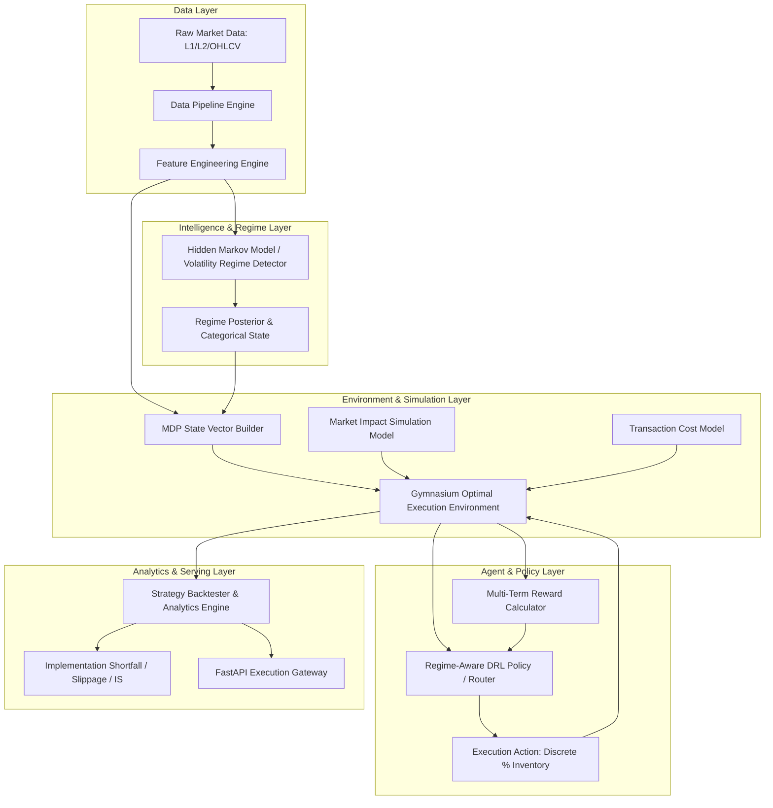

# System Architecture Document

## Overview
This document details the software architecture, data flow, component boundaries, and security/causality guardrails for the **Optimal Trade Execution with Regime-Aware DRL** system.

---

## Detailed Component Responsibilities

### 1. Data Pipeline Engine (`src/data/`)
- **Loader:** Ingests market data (OHLCV, tick, or Limit Order Book L1/L2 data) from Parquet files or SQL databases.
- **Preprocessor:** Normalizes timestamps, fills non-trading gaps, checks for missing ticks, and structures order books.
- **Feature Engineering:** Computes rolling returns, realized volatility, parkinson volatility, volume statistics, bid-ask spread estimators, and order flow imbalance (OFI).
- **Synthetic Market Generator:** Generates simulated order trajectories using Almgren-Chriss / Heston stochastic processes for stress testing.

### 2. Regime Detection Engine (`src/regimes/`)
- **HMM Classifier:** Unsupervised Hidden Markov Model (Gaussian HMM) fitted strictly on past sliding-window returns and volatility.
- **Volatility Threshold Classifier:** Rule-based fallback regime classifier (Low, Normal, High, Stress) derived from historical rolling quantile distributions.
- **Regime Interface:** Provides soft regime probabilities $P(\text{Regime}_k | \mathcal{F}_t)$ and hard discrete regime IDs $\{0, 1, 2, 3\}$.

### 3. MDP Gymnasium Environment (`src/env/`)
- **State Formulation:** Compiles price features, volatility, volume, bid-ask spread, liquidity metrics, remaining inventory percentage ($q_t / Q_0$), time remaining percentage ($t_{rem} / T$), and regime state vector.
- **Action Space:** Discrete inventory execution fractions $\{0.0, 0.10, 0.25, 0.50\}$ of remaining order size.
- **Reward Engine:** Calculates multi-term rewards penalizing:
  1. Implementation Shortfall against arrival benchmark ($P_0$).
  2. Temporary & Permanent market impact (Almgren-Chriss framework).
  3. Inventory risk (variance penalty over remaining inventory).
  4. Terminal penalty for unexecuted shares at deadline $T$.

### 4. Baseline Execution Strategies (`src/baselines/`)
- **TWAP:** Slices total inventory evenly into equal time intervals $N = T / \Delta t$.
- **VWAP:** Slices inventory dynamically according to historical intra-day volume profiles.
- **POV:** Slices inventory dynamically to match a target participation rate $\rho$ of real-time market volume.

### 5. DRL Agent & Policy Router (`src/agents/`)
- **SB3 Integration:** Standard Stable-Baselines3 algorithms (PPO / SAC / DQN) wrapped with regime-aware state feature inputs.
- **Regime-Conditioned Network:** Multi-head policy or regime-routed ensemble network where policy weights adjust based on the active regime embedding.

### 6. Evaluation & Analytics Engine (`src/evaluation/`)
- **Metrics Calculator:** Evaluates Implementation Shortfall (IS), VWAP slippage, Volume-weighted execution price, Sharpe/Sortino ratios of execution, and terminal fill rate.
- **Backtester:** Runs batch execution simulations over test periods without lookahead bias.

### 7. FastAPI Gateway & Serving (`src/api/`)
- **REST Endpoints:** Exposes execution recommendations, regime status queries, and backtest triggers via FastAPI schemas.

---

## Safety & Causality Guardrails
1. **Strict Lookahead Protection:** All feature functions receive a strict timestamp window $t' \le t$. Rollings and HMM predictions are fitted on training windows or online rolling filters without leakage.
2. **Deterministic Random Seeds:** Reproducibility across data splits, Gymnasium environments, PyTorch models, and SB3 agents via central seed manager (`src/utils/seed.py`).
3. **Graceful Fallbacks:** If HMM fails to converge or receives anomalous inputs, the regime engine falls back to rolling quantile volatility classification.
