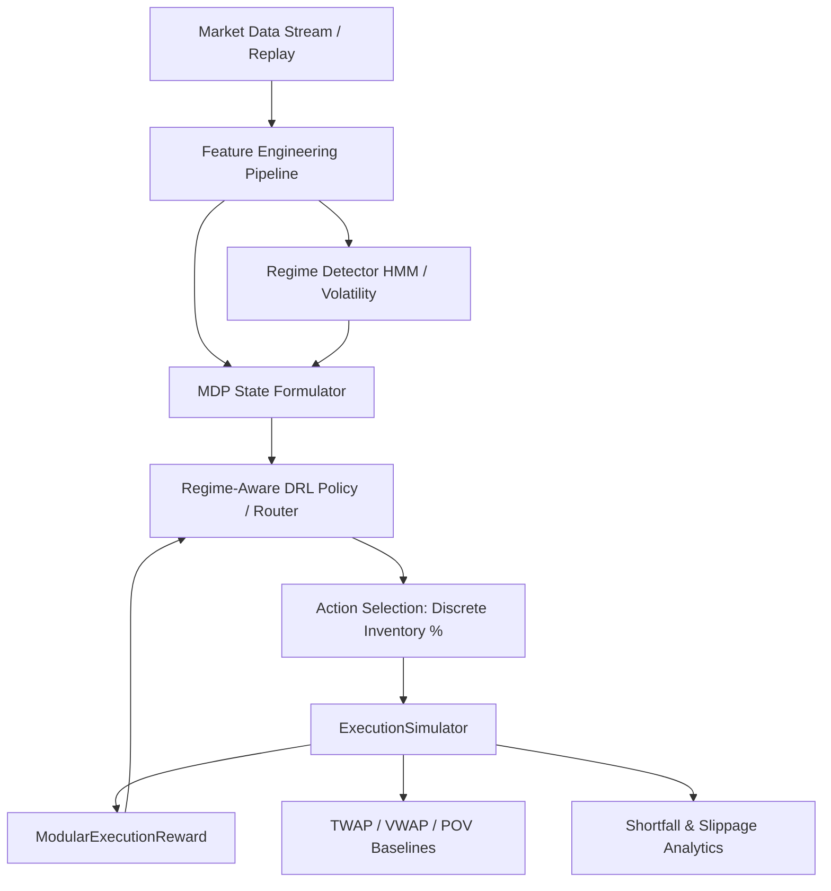

# KAIRO – Regime-Aware Deep Reinforcement Learning for Optimal Trade Execution

A research-grade framework for executing large institutional orders using Markov Decision Processes (MDP) and Regime-Aware Deep Reinforcement Learning (DRL).

## Core Research Question

> **Can a regime-aware deep reinforcement learning agent reduce implementation shortfall and execution cost compared with traditional execution strategies (TWAP, VWAP, POV) under changing market conditions?**

---

## Project Status

| Phase | Status | Description |
|---|---|---|
| **Phase 1: Architecture & MDP Design** | ✅ Complete | Repository layout, MDP definitions, research plan, config schemas, abstract interfaces |
| **Phase 2: Execution Simulation Engine** | ✅ Complete | `ExecutionSimulator`, Almgren-Chriss & Linear impact models, partial fills, terminal penalties |
| **Phase 3: Gymnasium MDP Environment** | ✅ Complete | `TradeExecutionEnv`, modular reward calculator, deterministic seeding, random rollout |
| **Phase 4: Data Pipeline & Features** | 🔜 Planned | Data loaders, feature engineering, order book metrics, anti-lookahead tests |
| **Phase 5: Regime Detection Engine** | 🔜 Planned | HMM & Volatility regime classifiers with rolling fit and temporal stability |
| **Phase 6: Baseline Strategies** | 🔜 Planned | TWAP, VWAP, and POV execution strategies for benchmark comparison |
| **Phase 7: DRL Agent Integration** | 🔜 Planned | Stable-Baselines3 integration, regime feature routing, policy network tuning |
| **Phase 8: Backtest & Evaluation** | 🔜 Planned | Implementation Shortfall backtest suite, regime metric breakdowns |
| **Phase 9: API & Containerization** | 🔜 Planned | FastAPI REST endpoints, MLflow tracking, Docker deployment |

---

## Architecture Overview



---

## Quickstart

```bash
# Clone repository
git clone https://github.com/nishnarudkar/KAIRO-Regime-Aware-Deep-Reinforcement-Learning-for-Optimal-Trade-Execution.git
cd regime-aware-trade-execution

# Create and activate virtual environment
python -m venv venv
venv\Scripts\activate        # Windows
# source venv/bin/activate   # macOS / Linux

# Install dependencies
pip install -r requirements.txt

# Configure Alpaca API credentials
cp .env.example .env        # then fill in your keys

# Run all unit tests
python -m pytest tests/ -v

# Run execution simulation demo (30-min AAPL TWAP)
python -m scripts.demo_execution_simulation

# Run Gymnasium random-action rollout demo
python -m scripts.demo_gym_rollout
```

---

## Key Components (Implemented)

### `ExecutionSimulator` — `src/execution/simulator.py`
Market replay engine for large parent-order execution.

- **Strict temporal causality**: only uses data up to step $t$; zero lookahead.
- **Impact models**: `LinearImpactModel` (configurable $\eta, \gamma$) and `AlmgrenChrissImpactModel` (power-law $\eta, \gamma, \alpha$).
- **Partial fills**: capped by maximum bar-volume participation rate ($\rho_{\max}$, default 15%).
- **Tracks**: `current_price`, `bid`, `ask`, `spread`, `volume`, `volatility`, `remaining_inventory`, `executed_inventory`, `average_execution_price`, `elapsed_time`, `remaining_time`, `execution_cost`, `market_impact`, `slippage`.
- **Terminal penalty**: heavy liquidation penalty for unexecuted inventory at horizon end.

### `TradeExecutionEnv` — `src/environment/env.py`
Gymnasium-compatible MDP wrapping `ExecutionSimulator`.

| | |
|---|---|
| **Observation Space** | `Box(7,)` continuous: log return, volatility, relative volume, relative spread, liquidity proxy, remaining inventory fraction, time remaining fraction |
| **Action Space** | `Discrete(4)`: execute 0%, 10%, 25%, 50% of remaining inventory |
| **Reward** | Modular penalty: shortfall + market impact + inventory risk + fees + terminal penalty |
| **Seeding** | Fully reproducible via `reset(seed=...)` |

### `ModularExecutionReward` — `src/environment/rewards.py`
Configurable multi-component reward penalizing:
- Execution shortfall cost (IS vs. arrival price)
- Temporary market impact
- Inventory holding risk
- Transaction fees
- Terminal incomplete order penalty

All weights documented and stored in `config/environment.yaml`.

---

## MDP Formal Specification

State vector at step $t$:

$$S_t = \begin{bmatrix} r_t,\ \sigma_t,\ V_t^{\text{rel}},\ S_t^{\text{rel}},\ L_t,\ q_t^{\text{rel}},\ \tau_t^{\text{rem}} \end{bmatrix}$$

Action space:

$$\mathcal{A} = \{0\%, 10\%, 25\%, 50\%\} \text{ of remaining inventory}$$

Modular reward:

$$R_t = -\left(\lambda_c \cdot C_t + \lambda_i \cdot I_t + \lambda_r \cdot \text{Risk}_t + \lambda_f \cdot F_t + \lambda_T \cdot P_T\right)$$

See [`docs/mdp.md`](docs/mdp.md) for the full specification. See [`docs/execution_model.md`](docs/execution_model.md) for simulator assumptions.

---

## Repository Structure

```
regime-aware-trade-execution/
├── config/                   # YAML configurations (env, agent, regimes)
│   ├── environment.yaml      # Env + reward weights + impact model params
│   ├── agent.yaml
│   └── regimes.yaml
├── data/                     # Market datasets
│   └── test_market_data.csv  # Deterministic 30-min AAPL replay dataset
├── docs/
│   ├── mdp.md                # Formal MDP specification
│   └── execution_model.md    # Simulator model assumptions & formulas
├── scripts/
│   ├── demo_execution_simulation.py  # TWAP replay demo
│   └── demo_gym_rollout.py           # Random Gymnasium rollout demo
├── src/
│   ├── execution/            # ExecutionSimulator + impact models
│   │   ├── simulator.py
│   │   └── impact_models.py
│   ├── environment/          # Gymnasium MDP + modular reward
│   │   ├── env.py
│   │   └── rewards.py
│   ├── data/                 # Data loaders & ingestion
│   ├── features/             # Feature engineering pipeline
│   ├── regimes/              # HMM & volatility regime classifiers
│   ├── agents/               # DRL agent wrappers (Stable-Baselines3)
│   ├── baselines/            # TWAP, VWAP, POV strategies
│   ├── evaluation/           # Backtest & IS analytics
│   ├── api/                  # FastAPI REST service
│   └── utils/                # Logging, seeding, MLflow helpers
├── tests/
│   ├── test_execution_simulator.py  # 7 simulator unit tests
│   └── test_trade_execution_env.py  # 6 Gymnasium env unit tests
├── requirements.txt
├── ARCHITECTURE.md
├── RESEARCH_PLAN.md
└── PROJECT_STATUS.md
```

---

## Tech Stack

| Layer | Technology |
|---|---|
| Language | Python 3.10+ |
| RL Environment | Gymnasium 1.3+ |
| RL Training | Stable-Baselines3 (planned) |
| Deep Learning | PyTorch (planned) |
| Regime Detection | hmmlearn, scikit-learn (planned) |
| Data | Pandas, NumPy, PyArrow |
| Market Data | Alpaca API (alpaca-py) |
| API Serving | FastAPI, Uvicorn (planned) |
| MLOps | MLflow, Docker (planned) |
| Testing | pytest, gymnasium env checker |

---

## Core Guardrails

1. **Zero Future Information**: Features, volatility, and regime at step $t$ use ONLY data up to $t$.
2. **Modular Interfaces**: Data, environment, agents, and reward are decoupled via abstract base classes.
3. **Documented Assumptions**: All impact model parameters and reward weights are documented in `docs/` and `config/`.
4. **Reproducibility**: Deterministic seeding throughout environment and simulator reset.
