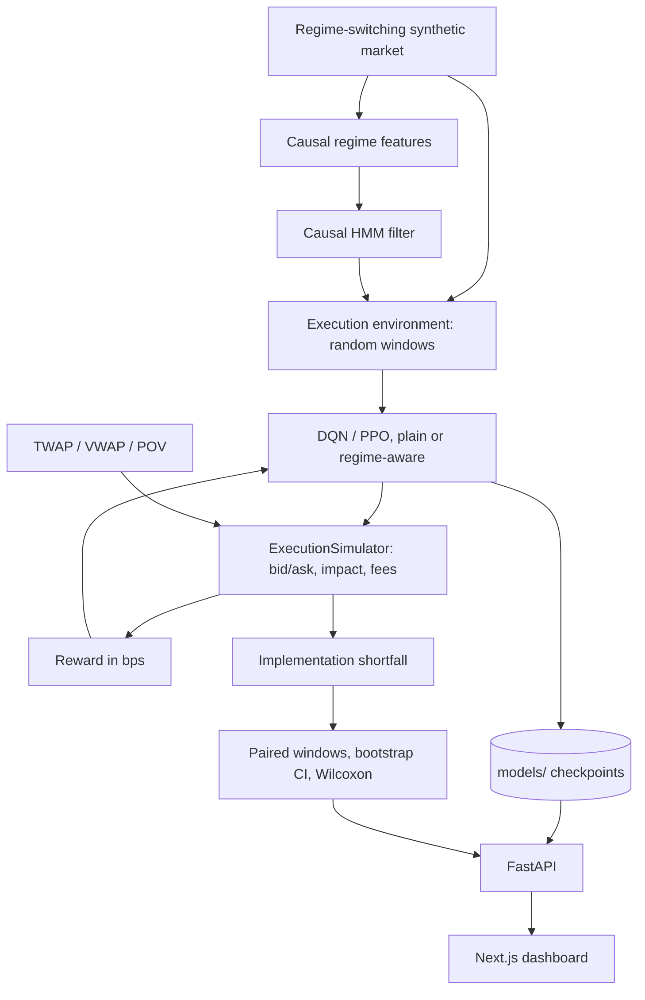

# KAIRO — Regime-Aware Deep Reinforcement Learning for Optimal Trade Execution

A research framework and demo platform for executing large parent orders with Markov Decision Processes, Hidden
Markov Model regime detection and deep reinforcement learning (DQN / PPO), evaluated against TWAP, VWAP and POV on a
regime-switching **synthetic** market.

> **Read this first.** Regime-aware RL does **not** show a robust advantage on this simulator: at a 30-minute horizon,
> learned policies sit within noise of TWAP/VWAP and behind POV, and the gain from regime features does not survive
> a shuffled-regime control. At a 90-minute horizon the DQN checkpoint (tuned for 30 minutes) breaks down badly,
> while PPO stays level with TWAP — a real finding about training/deployment mismatch, not about regimes. A small
> (5-day) transfer test on real AAPL bars is more encouraging but far too small to draw conclusions from. See
> [`docs/research_audit.md`](docs/research_audit.md) for the full results and their limits. Data is synthetic except
> for the labelled real-data test; nothing here is evidence about live trading.

---

## Research questions

> **RQ1** Does deep RL outperform TWAP, VWAP and POV?
> **RQ2** Does causally inferred regime information improve RL execution?
> **RQ3** Does regime-awareness help in turbulent markets and beat a shuffled-regime control?
> **RQ4** Is the effect the same for value-based (DQN) and policy-gradient (PPO) agents?

| | Main suite (5 seeds × 6 scenarios × 30 windows, 30-min horizon) | Long horizon (90 min) |
|---|---|---|
| RQ1 | Not robust: every learned policy within ~0.7 bps of TWAP/VWAP (CI includes 0); all costlier than POV | **DQN breaks down** (+27–29 bps vs TWAP); PPO stays level with TWAP |
| RQ2 | No clear evidence for either algorithm (CI includes 0) | DQN nominally better regime-aware, but tracks its instability, not a regime effect |
| RQ3 | Not supported: neither algorithm beats its shuffled-regime control | Same picture; one CI excludes 0 but reads as DQN instability, not a clean effect |
| RQ4 | No consistent effect across algorithms | DQN and PPO diverge sharply at longer horizon |

A small (5-day) transfer test on real AAPL bars is more encouraging (every learned policy nominally beats TWAP/VWAP)
but far too small a sample to draw conclusions from. Full numbers, tuning process and caveats:
[`docs/research_audit.md`](docs/research_audit.md), [`docs/tuning.md`](docs/tuning.md).

---

## Project status

**198 automated tests (100% passing), CI on every push.** Stages 0–16 complete (simulator, environment, HMM, baselines, agents, hyperparameter tuning, MLflow remote tracking, API, UI, explanations, paper-trading gates, Docker).

| Area | State |
|---|---|
| Synthetic market | Regime-switching, realistic per-minute scale, zero drift, bid/ask, causal volatility |
| Environment | Random-window episodes, causal observations, well-scaled state and reward, warm-started regime filter |
| Baselines | TWAP, VWAP (real ex-ante volume profile), POV |
| Agents | DQN, PPO, regime-aware variants and shuffled-regime controls; hyperparameter tuned & served from `models/` |
| MLflow Tracking | Remote experiment tracking integrated via DagsHub MLflow |
| Experiments | Paired multi-window evaluation, hyperparameter grid search, drift-free validation, real market data tests |
| API | Persistent (SQLite), API-key-protected order routes, restricted CORS, honest model status, errors surfaced |
| UI | Next.js 14 dashboard showing real model status, paired statistics and recorded experiment results |
| Packaging | Complete `requirements.txt`, Docker (Python 3.13, standalone Next.js container, non-root user), GitHub Actions CI |

---

## Screenshots

| View | Screenshot |
|---|---|
| **Order ticket** |  |
| **Monitor** |  |
| **Analytics** |  |
| **Strategy comparison** (paired, with CIs) |  |
| **Research** (regime detector + recorded results) |  |

---

## Architecture



---

## Quickstart

```bash
python -m venv venv
venv\Scripts\activate            # Windows   (source venv/bin/activate on macOS / Linux)
pip install -r requirements.txt  # Python 3.11+
```

### Run the tests

```bash
python -m pytest tests/                                          # 198 tests passing
```

### Train models & run hyperparameter tuning

```bash
python scripts/train_models.py                                   # writes models/*.zip + registry.json
python scripts/tune_agents.py --jobs 30 --timesteps 150000        # learning-rate / network-width / entropy search
```

Tuning selects hyperparameters on seeds and scenarios disjoint from every experiment above (see
[`docs/tuning.md`](docs/tuning.md)); `scripts/train_models.py` and `scripts/run_experiments.py` already use the
selected values by default.

### Optional: DagsHub MLflow remote tracking

Set `DAGSHUB_USERNAME` / `DAGSHUB_TOKEN` and the legacy `scripts/train.py` / `scripts/run_ab_experiment.py` /
`scripts/run_ppo_experiment.py` demo runners will log to DagsHub's MLflow instead of the local `mlruns/` store
(`src/utils/dagshub_utils.py`). The main pipeline (`train_models.py`, `run_experiments.py`) does not use MLflow.

### Run the API

```bash
uvicorn src.api.main:app --host 127.0.0.1 --port 8000            # docs at /docs
```

The repository already contains trained checkpoints and results, so you can start the API directly. Learned
policies without a checkpoint return `503` rather than a fabricated result.

### Run the dashboard

```bash
cd frontend
npm install
npm run dev                                                      # http://localhost:3000
```

### Reproduce the research results

```bash
python scripts/run_experiments.py --seeds 42 123 777 2024 31415 --timesteps 150000 --jobs 26        # results/
python scripts/run_experiments.py --horizon 90 --n-bars 6000 --seeds 42 123 777 2024 \
    --timesteps 150000 --jobs 26 --results-dir results/long_horizon                                  # 90-min horizon
python scripts/evaluate_real_data.py --out results/real_data                                          # real AAPL bars
python scripts/make_report.py                              # writes REPORT.md for each suite (pass --results-dir)
```

### Docker

```bash
docker compose up -d --build     # backend :8000, dashboard :3000
```

See [`docs/docker_deployment.md`](docs/docker_deployment.md) and `.env.example` for configuration.

---

## API

| Method | Endpoint | Description |
|---|---|---|
| `POST` | `/api/execution/simulate` | One policy on an out-of-sample window (`503` if the learned policy is untrained) |
| `POST` | `/api/execution/backtest` | Several policies over 1–30 identical windows; mean, CI, paired difference vs TWAP; `errors` for failures |
| `GET` | `/api/execution/{id}` `/metrics` `/trajectory` | Stored results (SQLite) |
| `GET` | `/api/execution/{id}/explain?step=N` | Explanation of the trained network's decision at a step |
| `POST` | `/api/execution/explain` | Explain a decision for a given state (trained policies only) |
| `POST` | `/api/execution/paper` 🔒 | Route a slice through the risk gates (mock paper executor) |
| `POST` | `/api/execution/kill-switch` 🔒 | Emergency halt |
| `GET` | `/api/execution/risk-status` | Risk-gate configuration |
| `GET` | `/api/regime/current` | Causal HMM regime at the latest bar |
| `GET` | `/api/models` | Trained status, training steps and held-out evaluation per model |
| `GET` | `/api/experiments` / `/api/experiments/results` | Experiment status and the recorded results |
| `GET` | `/api/baselines`, `/health` | Baselines, liveness |

🔒 requires `X-API-Key` matching `KAIRO_API_KEY`; refused when no key is configured. Full reference:
[`docs/fastapi_backend.md`](docs/fastapi_backend.md).

---

## Repository layout

```
config/            YAML documentation of parameters (checked against the code by a test)
docs/              methodology, audit, API / UI / Docker references
frontend/          Next.js 14 + TypeScript dashboard with standalone Docker configuration
models/            trained checkpoints, pooled HMM and registry.json (evaluation of each model)
results/           experiment outputs (archive_v1/, tuning/, real_data/)
scripts/           run_experiments.py, train_models.py, tune_agents.py, make_report.py
src/agents/        DQN / PPO wrappers, model registry, explainer
src/api/           FastAPI app, engine, security, SQLite store, routers
src/baselines/     TWAP, VWAP (ex-ante volume profile), POV, runner
src/environment/   TradeExecutionEnv, RegimeAwareTradeExecutionEnv, reward
src/evaluation/    scenarios, protocol (splits, windows, statistics), experiment runner, ablation control
src/execution/     ExecutionSimulator, impact models, risk gates, paper executor
src/regimes/       Gaussian HMM, causal forward filter, features
tests/             198 unit tests (causality, protocol, API hardening, end-to-end)
```

## Guardrails

1. **Causality.** Features, volatility, the volume reference, the VWAP profile and regime beliefs at step *t* use only
   bars up to *t*; tests change the future and assert nothing earlier moves.
2. **Chronological split.** Train on the first 70%, evaluate on the last 30%; the HMM is fitted on train only.
3. **Controls.** A shuffled-regime agent with the same input size isolates the value of regime information.
4. **Paired, replicated evaluation.** Every strategy runs on identical windows; results are replicated over seeds and
   reported with confidence intervals.
5. **Honest serving.** No training inside requests; untrained models are labelled and refused; failures are reported.

## Known limitations

Mostly synthetic data (one real 5-day transfer test); order size now scales with liquidity, but hyperparameters were
tuned only once on 2 seeds; the DQN checkpoint does not generalise from a 30- to a 90-minute horizon; Alpaca
execution remains mock-mode. Details in [`docs/research_audit.md`](docs/research_audit.md).
