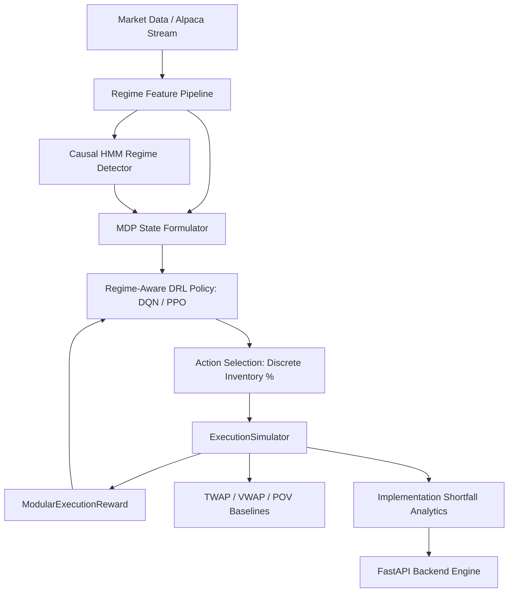

# KAIRO — Regime-Aware Deep Reinforcement Learning for Optimal Trade Execution

A research-grade framework and production platform for executing large institutional orders using Markov Decision Processes (MDP), Hidden Markov Model (HMM) Market Regime Detection, and Regime-Aware Deep Reinforcement Learning (DRL).

---

## 🎯 Core Research Questions

> **RQ1:** Does Deep Reinforcement Learning outperform conventional execution baselines (TWAP, VWAP, POV)?  
> **RQ2:** Does causally-inferred market regime information improve RL trade execution quality?  
> **RQ3:** Does regime-awareness improve execution robustness during market stress and regime transitions?  
> **RQ4:** Is the regime-aware performance improvement algorithm-class-agnostic (reproducible across both value-based DQN and policy-gradient PPO)?

---

## 📊 Project Status & Progress Tracker

**120 / 120 Unit Tests Passing ✅ | Stages 0–13 Complete**

| Stage | Name | Status | Description / Key Deliverables |
|---|---|---|---|
| **Stage 0** | Repository Architecture | ✅ Complete | Directory layout, YAML config schemas, abstract base classes |
| **Stage 1** | Execution Simulator | ✅ Complete | `ExecutionSimulator`, Almgren-Chriss & Linear impact models, partial fills, terminal penalties |
| **Stage 2** | Gymnasium MDP Environment | ✅ Complete | `TradeExecutionEnv`, `ModularExecutionReward`, reproducible seeding |
| **Stage 3** | Data Pipeline | ✅ Complete | Alpaca API ingestion, chronological train/test splitting, zero lookahead validation |
| **Stage 4** | Market Regime Engine | ✅ Complete | Gaussian HMM, 4 canonical regimes (Low Vol, Normal, High Vol, Stress), `CausalRegimeInference` forward filter |
| **Stage 5** | Baseline Strategies | ✅ Complete | TWAP, VWAP, and POV benchmark execution strategies + `BaselineRunner` |
| **Stage 6** | DQN Baseline Agent | ✅ Complete | `DQNAgent` (SB3 DQN), `evaluate_agent`, MLflow tracking integration |
| **Stage 7** | Regime-Aware DQN | ✅ Complete | `RegimeAwareTradeExecutionEnv` (12-dim state), Model A vs Model B A/B experiment |
| **Stage 8** | Research Experiment Suite | ✅ Complete | 6 synthetic scenarios, 3 random seeds, shuffled-regime control ablation, `ResultsAggregator` |
| **Stage 9** | PPO Extension | ✅ Complete | `PPOAgent`, `ppo.yaml`, 4-model multi-algorithm comparison (DQN vs PPO), RQ4 methodology |
| **Stage 10**| FastAPI Backend Service | ✅ Complete | REST API (`/simulate`, `/backtest`, `/{id}`, `/regime/current`, `/models`, `/baselines`), OpenAPI docs |
| **Stage 11**| Next.js Product UI | ✅ Complete | Adaptive Execution Intelligence frontend dashboard (5 interactive tabs, Recharts analytics) |
| **Stage 12**| Decision Explanation Layer| ✅ Complete | Post-hoc feature contribution (`DecisionExplainer`), regime influence scoring, `docs/explanations.md` |
| **Stage 13**| Alpaca Paper Trading | ✅ Complete | `ExecutionRiskGate` (4 safety gates, kill switch), `AlpacaPaperExecutor`, `/paper` API endpoint |
| **Stage 14**| Docker Packaging | 🔜 Next | Containerization (Docker Compose for backend, frontend, MLflow) |
| **Stage 15**| Research & Audit | 🔜 Planned | Formal research & reproducibility audit (`docs/research_audit.md`) |

---

## 🏗 Architecture Overview



---

## 🚀 Quickstart & Server Execution

### 1. Installation & Environment Setup

```bash
# Clone repository
git clone https://github.com/nishnarudkar/KAIRO-Regime-Aware-Deep-Reinforcement-Learning-for-Optimal-Trade-Execution.git
cd regime-aware-trade-execution

# Create and activate virtual environment
python -m venv venv
venv\Scripts\activate        # Windows
# source venv/bin/activate   # macOS / Linux

# Install dependencies
pip install -r requirements.txt
```

### 2. Run Test Suite (108 Unit Tests)

```bash
# Run full unit test suite across all modules
$env:PYTHONPATH='.'; .\venv\Scripts\pytest tests/ -v --tb=short
```

### 3. Launch FastAPI Backend Server

```bash
# Start FastAPI backend server with hot-reload
uvicorn src.api.main:app --reload --host 127.0.0.1 --port 8000
```

- **Interactive Swagger UI**: [http://127.0.0.1:8000/docs](http://127.0.0.1:8000/docs)
- **ReDoc Specification**: [http://127.0.0.1:8000/redoc](http://127.0.0.1:8000/redoc)

### 4. Run CLI Experiments & Demos

```bash
# Run Stage 8 Full Research Experiment Suite (6 scenarios, 3 seeds)
python scripts/run_experiments.py --seeds 42 123 777

# Run Stage 9 Multi-Algorithm PPO Comparison (4 models head-to-head)
python scripts/run_ppo_experiment.py --timesteps 50000 --seed 42

# View MLflow experiment dashboard
mlflow ui
```

---

## ⚡ FastAPI Endpoint Reference (`Stage 10`)

| Method | Endpoint | Description |
|---|---|---|
| `POST` | `/api/execution/simulate` | Execute a single order simulation (TWAP, VWAP, POV, DQN, Regime DQN, PPO, Regime PPO) |
| `POST` | `/api/execution/backtest` | Run multi-policy backtest comparison across market scenarios |
| `GET` | `/api/execution/{id}` | Query execution record summary by unique UUID |
| `GET` | `/api/execution/{id}/metrics` | Query detailed execution quality metrics (IS bps, cost, fill %, VWAP slip) |
| `GET` | `/api/execution/{id}/trajectory` | Query step-by-step price, inventory, and action trajectories |
| `POST`| `/api/execution/paper` | Validate order against pre-trade risk gates & route to Alpaca Paper Trading |
| `GET` | `/api/execution/risk-status` | Query active pre-trade risk gate configuration & emergency kill switch state |
| `POST`| `/api/execution/kill-switch` | Trigger or reset emergency halt kill switch |
| `GET` | `/api/regime/current` | Detect current market regime using causal HMM online forward filter |
| `GET` | `/api/baselines` | List conventional execution baseline strategies |
| `GET | `/api/models` | List available DRL model metadata |
| `GET` | `/api/experiments` | List research experiment suites and scenarios |
| `GET` | `/health` | Service health check |

---

## 🛠 Key Implemented Modules

### 1. `ExecutionSimulator` — `src/execution/simulator.py`
Market replay engine enforcing strict temporal causality (zero lookahead) with Almgren-Chriss & Linear market-impact models, partial fills, commissions, and terminal penalties.

### 2. `RegimeAwareTradeExecutionEnv` — `src/environment/regime_env.py`
Gymnasium MDP environment with 12-dimensional state vector $[I_t, T_{\text{rem}}, \Delta P_t, \sigma_t, S_{\text{bid-ask}}, V_t, \overline{V}, S_t^{\text{regime}}, P(S_t=0), \dots, P(S_t=3)]$.

### 3. `MarketHMM` & `CausalRegimeInference` — `src/regimes/`
Gaussian Hidden Markov Model with 4 canonical market regimes (Low Vol, Normal, High Vol, Stress) fitted exclusively on training data, evaluated online using the forward algorithm $P(S_t = k \mid X_{1:t})$.

### 4. DRL Agent Wrappers — `src/agents/`
- **`DQNAgent`**: Off-policy Q-learning wrapper over Stable-Baselines3 DQN.
- **`PPOAgent`**: On-policy policy-gradient wrapper over Stable-Baselines3 PPO (`config/ppo.yaml`).

### 5. `ResultsAggregator` — `src/evaluation/metrics.py`
Aggregates single-run execution records into summary pivot tables, calculates implementation shortfall deltas, and exports structured CSV/JSON/Parquet outputs.

---

## 📁 Repository Structure

```
regime-aware-trade-execution/
├── config/                   # Configuration files
│   ├── environment.yaml      # MDP & simulator settings
│   ├── dqn.yaml              # DQN hyperparameter config
│   ├── ppo.yaml              # PPO hyperparameter config
│   └── regimes.yaml          # HMM & feature config
├── docs/                     # Research & API documentation
│   ├── mdp.md                # Formal MDP formulation
│   ├── execution_model.md    # Market impact & simulator specifications
│   ├── market_regimes.md     # HMM regime detection methodology
│   ├── experiments.md        # Stage 8 research experiment design
│   ├── ppo_extension.md      # Stage 9 PPO extension & RQ4 analysis
│   ├── fastapi_backend.md    # Stage 10 FastAPI backend reference
│   ├── frontend_ui.md        # Stage 11 Next.js frontend UI documentation
│   └── research_questions.md # Formal research questions (RQ1–RQ4)
├── frontend/                 # Next.js 14 TypeScript Product UI
│   ├── src/app/              # App router pages & tab components
│   ├── src/components/       # UI layout & tabs
│   └── src/lib/api.ts        # Typed API client for FastAPI backend
├── scripts/                  # Executable CLI scripts
│   ├── run_experiments.py    # Full research suite runner
│   ├── run_ppo_experiment.py # 4-model PPO comparison runner
│   └── evaluate.py           # Model evaluation script
├── src/                      # Core python packages
│   ├── agents/               # DQNAgent, PPOAgent, evaluator, A/B runners
│   ├── api/                  # FastAPI app, schemas, store, routers
│   ├── baselines/            # TWAP, VWAP, POV strategies & runner
│   ├── environment/          # TradeExecutionEnv, RegimeAwareTradeExecutionEnv
│   ├── execution/            # ExecutionSimulator & impact models
│   ├── features/             # Feature engineering pipeline
│   ├── regimes/              # MarketHMM, CausalRegimeInference, scaler
│   └── utils/                # Logging, seeding, MLflow utilities
├── tests/                    # Unit test suite (108 tests)
│   ├── test_api.py           # FastAPI TestClient tests
│   ├── test_ppo_agent.py     # PPO agent & experiment tests
│   ├── test_experiments.py   # Research suite tests
│   ├── test_regime_aware_env.py
│   ├── test_regimes.py
│   └── test_execution_simulator.py
├── requirements.txt
└── README.md
```

---

## 🔬 Core Guardrails & Hard Rules

1. **Strict Anti-Lookahead Causality**: Features, volatility, and regime state at step $t$ consume ONLY observations $X_{1:t}$.
2. **Chronological Splitting**: Time-series data is split strictly chronologically (70% train / 30% test). **No random shuffling**.
3. **Control Conditions**: Shuffled/randomized regime controls are evaluated to ensure improvements stem from genuine regime signals.
4. **Reproducibility**: Deterministic seeding across environment resets, data generators, and DRL policy initialization.
