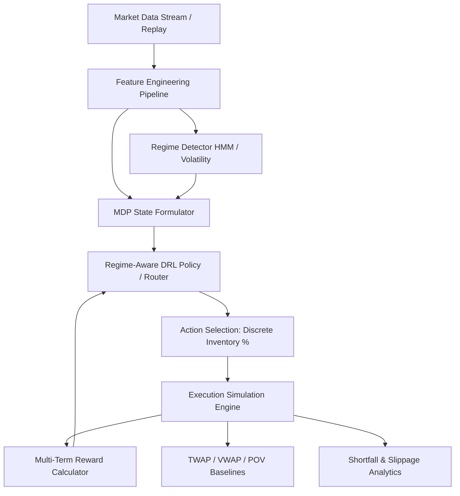

# Optimal Trade Execution with Regime-Aware Deep Reinforcement Learning

A research-grade and production-ready framework for executing large institutional orders using Markov Decision Processes (MDP) and Regime-Aware Deep Reinforcement Learning (DRL).

## Core Research Question
> **Can a regime-aware deep reinforcement learning agent reduce implementation shortfall and execution cost compared with traditional execution strategies (TWAP, VWAP, POV) under changing market conditions?**

---

## Technical Architecture Overview



---

## Comparative Strategy Matrix
1. **TWAP (Time-Weighted Average Price):** Linear slice execution across time horizon.
2. **VWAP (Volume-Weighted Average Price):** Execution matched to empirical intra-day volume curves.
3. **POV (Percentage of Volume):** Execution tracking real-time market volume participation.
4. **Baseline DRL:** Deep RL agent trained without explicit regime inputs.
5. **Regime-Aware DRL (Proposed):** Deep RL agent conditioned on market regime state (Low Volatility, Normal, High Volatility, Stress).

---

## Directory Structure Overview

```
regime-aware-trade-execution/
├── config/                  # Structured YAML configurations (env, agent, regimes)
├── data/                    # Market dataset storage (raw, processed, synthetic)
├── docs/                    # Architectural diagrams, MDP specifications, research specs
├── src/                     # Core Python modules
│   ├── data/                # Data loaders and ingestion pipelines
│   ├── features/            # Feature engineering (volatility, spread, OFI)
│   ├── regimes/             # HMM regime identification & volatility models
│   ├── environment/         # Gymnasium optimal execution MDP environment & reward design
│   ├── execution/           # Market impact models (Almgren-Chriss) & execution engines
│   ├── agents/              # SB3 wrappers & regime-aware routing logic
│   ├── baselines/           # TWAP, VWAP, POV implementation baselines
│   ├── evaluation/          # Backtester, analytics, Implementation Shortfall calc
│   ├── api/                 # FastAPI REST services & execution engine endpoints
│   └── utils/               # Logging, metrics, seed setters, MLflow helpers
├── tests/                   # Modular unit tests (pytest framework)
├── ARCHITECTURE.md          # Full technical architecture design
├── RESEARCH_PLAN.md         # Research methodology, metrics, and experimental design
└── PROJECT_STATUS.md        # Assumptions, data leakage controls, milestone tracker
```

---

## Tech Stack
- **Language:** Python 3.10+
- **Deep Learning Framework:** PyTorch
- **RL Framework:** Gymnasium, Stable-Baselines3
- **Machine Learning & Regimes:** scikit-learn, hmmlearn
- **Data Engineering:** Pandas, NumPy, PyArrow / Parquet
- **Backend API:** FastAPI, Uvicorn, Pydantic
- **Frontend Dashboard:** Next.js / React / TypeScript (Planned)
- **MLOps & Tracking:** MLflow, Docker
- **Testing & Quality:** Pytest, Flake8, Black

---

## Quickstart Setup

```bash
# Clone the repository
git clone https://github.com/your-org/regime-aware-trade-execution.git
cd regime-aware-trade-execution

# Create virtual environment
python -m venv venv
source venv/bin/activate  # On Windows: venv\Scripts\activate

# Install development dependencies
pip install -r requirements.txt
```

---

## Core Rules & Guardrails
1. **Zero Future Information (Strict Causality):** Features, volatility estimates, and regime classifications at time $t$ MUST ONLY use data available up to time $t$.
2. **Modular Components:** Data preprocessors, regime classifiers, environments, and agents are decoupled via strict Python interfaces.
3. **No Cosmetic RL:** RL agents optimize well-defined market dynamics with realistic transaction costs and market impact penalties.
